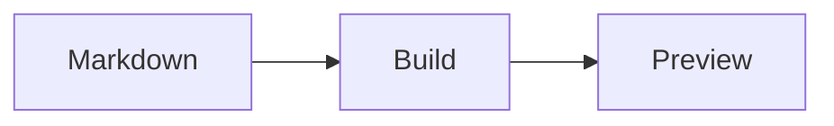

# WeChatLoom

WeChatLoom is a local Go CLI plus a portable Codex Skill for turning Markdown into deterministic, mobile-first HTML for WeChat Official Accounts.

The current `0.3.0-dev` line includes the complete v0.2 local visual workflow and the first v0.3 media slice: remote Markdown images are materialized as content-addressed build assets with DNS/IP SSRF checks, redirect revalidation, MIME, size, pixel, and timeout limits. It does not connect to WeChat or create a draft yet.

## Quick start

Requires Go 1.24 or newer.

```bash
go build -o wechatloom ./cmd/wechatloom
./wechatloom init .
./wechatloom capabilities --json
./wechatloom theme list --json
./wechatloom inspect article.md --json
./wechatloom build article.md --root . --theme tech-cyan --json
```

The build response returns a build directory under `.wechatloom/builds/`. Open the interactive preview or create 2× PNG screenshots at 320, 375, and 430 px:

```bash
./wechatloom preview .wechatloom/builds/<build-id>
./wechatloom snapshot .wechatloom/builds/<build-id> --json
```

`preview` binds only to `127.0.0.1`, serves the completed preview and resolved assets read-only, and stops on Ctrl+C. `snapshot` discovers local Chrome, Chromium, or Edge; set `WECHATLOOM_BROWSER` to an explicit executable when needed. Missing a browser never blocks HTML builds.

## Themes and components

Runtime discovery is the fact source:

```bash
./wechatloom theme show editorial-blue --json
./wechatloom component show timeline --json
./wechatloom component export --all --output ./components-export --json
```

Theme packages are data-only. They can be shared and installed per project:

```bash
./wechatloom theme export --all --output ./themes-export --json
./wechatloom theme validate ./themes-export/minimal/theme.json --json
./wechatloom theme install ./themes-export/minimal/theme.json --root . --json
```

Installed themes live under `.wechatloom/themes/<name>/theme.json` and override a built-in theme with the same name. Conflicting installs require an explicit `--force`. Remote fonts, invalid colors, unsafe typography ranges, low text contrast, and unknown fields are rejected.

Use `theme list --root . --json` or `theme show <name> --root . --json` to include installed project overrides in discovery.

Component syntax uses strict YAML directives:

```markdown
:::wx-hero
title: 用一套稳定流程把 Markdown 送进公众号
subtitle: 先构建，再预览
:::
```

All 24 schemas plus valid and invalid examples are committed under `components/`.

## Rich media

Display formulas and safe flow diagrams are rendered to content-addressed, high-resolution PNG files without network access:

````markdown
$$
E = mc^2
$$


````

The v0.2 Mermaid renderer intentionally supports a safe flowchart subset: `flowchart`/`graph`, `LR`/`RL`/`TD`/`TB`, and `A --> B` edges. URLs, click handlers, custom styles, and executable markup are rejected. Formula rendering supports display expressions, superscripts, subscripts, common Greek/operators, simple fractions, and square roots.

## Configuration and artifacts

Project defaults live in `.wechatloom/project.yaml`:

```yaml
schema_version: "1"
project:
  name: wechatloom-project
build:
  theme: minimal
  output_dir: .wechatloom/builds
```

Theme priority is CLI `--theme`, then article frontmatter, then project configuration. Never place WeChat credentials or access tokens in project configuration.

Each atomic build contains `article.html`, `preview.html`, `layout-plan.json`, `manifest.json`, diagnostics, derived Markdown, content-addressed assets, and a snapshots directory. The source Markdown remains unchanged. The manifest records hashes, tool and protocol versions, resolved theme tokens, component schema versions, rendering policy, and every artifact.

## JSON protocol contract

Every `--json` success, validation error, and command failure uses the same versioned envelope. The public Draft 2020-12 contract is committed at [`schemas/protocol-envelope.schema.json`](schemas/protocol-envelope.schema.json). Its eight fields are always present; `data` is JSON `null` when a response has no structured payload. This schema is the first frozen V1.0 stability boundary.

## Portable Codex Skill

The Skill is bundled into the CLI and is also available in `skills/wechatloom/`. Check, install, or explicitly update it with:

```bash
wechatloom skill status codex --json
wechatloom skill install codex --json
wechatloom skill update codex --json
```

`status` is read-only. `install` and `update` write only after the explicit command, record the CLI source version and bundled file hashes, and use staging plus rollback directories for recoverable replacement. Set `CODEX_HOME` or pass `--codex-home <dir>` to target a non-default Codex home.

The Skill discovers runtime themes and components, recommends a restrained layout, keeps the source read-only by default, and reports that the current v0.3 development CLI still cannot create a WeChat draft.

## Validation

```bash
go test -race ./...
go vet ./...
go build ./cmd/wechatloom
WECHATLOOM_VISUAL_REGRESSION=1 go test ./internal/snapshot -run TestComponentGalleryVisualBaseline
```

The checked-in visual baselines cover the complete component gallery at all three mobile widths. CI also captures a smoke artifact with pinned Chrome for Testing 150.

See the [v0.2 release notes](docs/releases/v0.2.md), [product requirements](docs/product/wechatloom-prd.md), [architecture](docs/architecture/wechatloom-architecture.md), [implementation roadmap](docs/roadmap/wechatloom-implementation-roadmap.md), and [visual regression guide](docs/visual-regression.md).

WeChatLoom is independent and is not affiliated with, endorsed by, or sponsored by Tencent or WeChat.

## License

Source, bundled themes, components, and the Skill use the PolyForm Noncommercial License 1.0.0. Personal and other permitted noncommercial uses are allowed; commercial use is not licensed.
