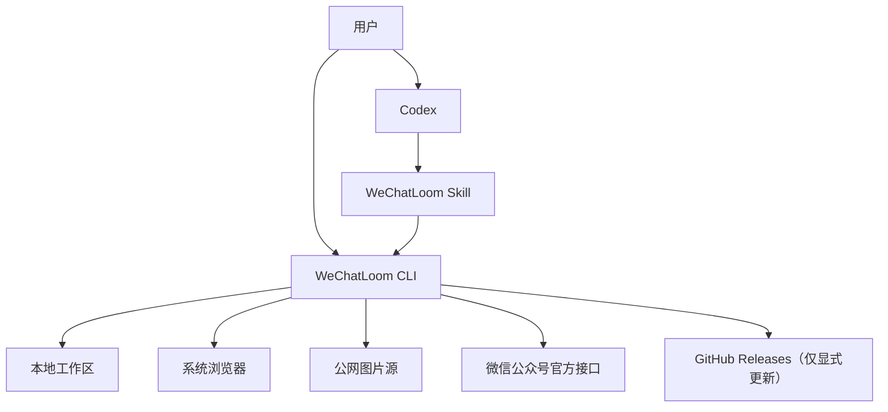
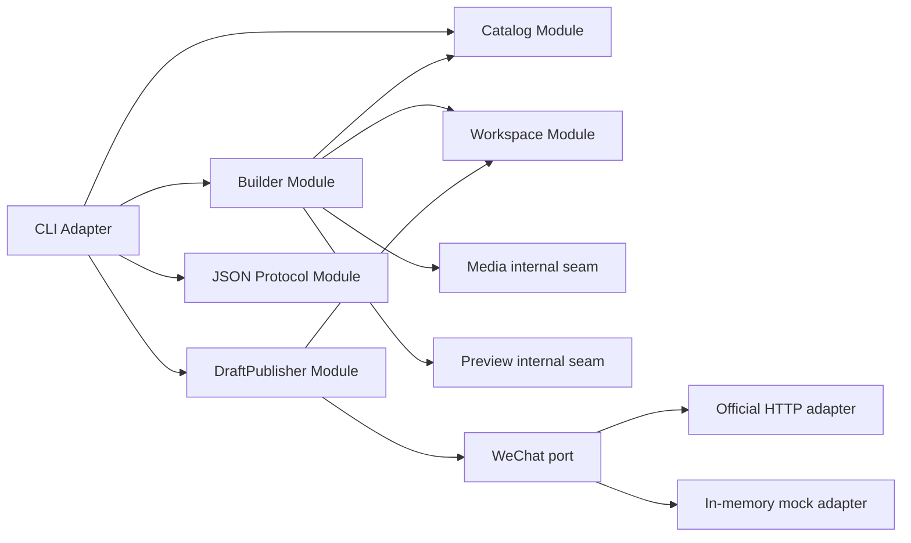
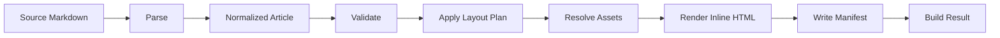
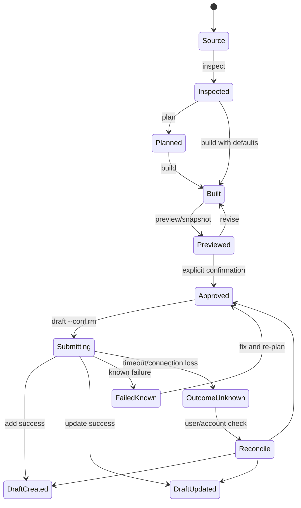

# WeChatLoom 架构设计

> 日期：2026-07-29
> 设计目标：以少量深模块隐藏解析、渲染、媒体和微信调用复杂度，使 CLI、Codex Skill 与测试共享同一接口。

## 1. 架构原则

1. **本地优先。** 除远程图片、显式更新和微信操作外，构建流程离线运行。
2. **确定性优先。** 相同版本、输入和配置得到相同 HTML。
3. **副作用后置。** 检查、规划、构建和预览不产生微信远程写入。
4. **接口即测试面。** 测试从模块接口验证可观察结果，不穿透实现。
5. **接受依赖，不创建依赖。** 真正变化的外部依赖通过端口注入适配器。
6. **深模块优先。** CLI 不负责拼接解析器、渲染器、图片工具和缓存步骤。
7. **协议稳定。** Codex Skill 只依赖版本化 CLI 接口和 JSON envelope。

## 2. 系统上下文



WeChatLoom 不包含云端控制面。所有持久状态位于用户机器和微信公众号。

## 3. 主要深模块

架构只向上层暴露三个主要业务模块接口：

1. `Builder`：把源 Markdown 变成可验证、可预览、可提交的本地构建结果；
2. `Catalog`：发现主题、组件、能力和 schema；
3. `DraftPublisher`：验证账号并新增或更新微信草稿。

配置、工作区和协议是横切基础模块，不把内部细节暴露给 CLI。



## 4. Builder 模块

### 4.1 接口

```go
type Builder interface {
    Inspect(ctx context.Context, req InspectRequest) (Inspection, error)
    Build(ctx context.Context, req BuildRequest) (BuildResult, error)
    Preview(ctx context.Context, req PreviewRequest) (PreviewResult, error)
}
```

接口包含的调用约束：

- `Inspect`、`Build`、`Preview` 不允许产生微信远程写入；
- 输入源文件默认只读；
- `Build` 必须返回内容哈希、警告、构建清单和产物路径；
- `Preview` 只能消费已成功构建的结果；
- 同一锁定输入必须产生相同 HTML；
- 所有错误携带稳定错误码和可定位上下文；
- 浏览器缺失只能阻塞截图，不阻塞 HTML 构建。

### 4.2 隐藏的实现

`Builder` 内部集中处理：

- Frontmatter 和 Markdown 解析；
- CommonMark/GFM；
- 原始 HTML 清洗；
- `:::wx-*` 解析与 schema 校验；
- 文章模型规范化；
- 主题和设计变量解析；
- 布局计划验证；
- 代码高亮；
- 数学公式渲染；
- Mermaid 渲染；
- 本地与远程图片解析；
- SSRF 防护；
- 图片压缩与派生；
- 链接策略；
- 微信兼容内联样式；
- 构建目录；
- 发布清单；
- 内容哈希；
- 本地预览页面；
- 截图调用。

删除该模块会让上述复杂度扩散到 `inspect`、`build`、`render`、`preview`、`snapshot` 和 Skill，因此该模块具备足够深度。

### 4.3 内部数据流



`NormalizedArticle` 是 Builder 实现内部的稳定中间表示，不作为 CLI JSON 的公共契约。

### 4.4 依赖分类

| 依赖 | 分类 | 策略 |
|---|---|---|
| Markdown、主题、组件渲染 | 进程内 | 直接测试 Builder 接口 |
| 文件系统 | 本地可替代 | 测试使用临时目录 |
| 远程图片 | 真外部 | 内部下载端口 + HTTP/Mock 适配器 |
| 浏览器截图 | 本地可替代 | Browser 适配器 + Fake 适配器 |

下载端口和浏览器端口是 Builder 内部 seam，不暴露到外部接口。

## 5. Catalog 模块

### 5.1 接口

```go
type Catalog interface {
    Capabilities(ctx context.Context) (Capabilities, error)
    List(ctx context.Context, query CatalogQuery) (CatalogResult, error)
    Show(ctx context.Context, ref ResourceRef) (ResourceDefinition, error)
    Validate(ctx context.Context, ref ResourceRef) (ValidationResult, error)
}
```

`ResourceRef.Kind` 只允许：

- `theme`；
- `component`；
- `skill`；
- `schema`。

### 5.2 模块深度

Catalog 隐藏：

- 内置主题；
- 用户主题目录；
- 项目主题目录；
- 资源优先级；
- 主题包 manifest；
- schema 版本；
- 安装兼容性；
- 完整示例；
- 选择元数据；
- 资源版本冲突。

Codex Skill 不读取仓库源码来猜能力，只跨 Catalog 接口发现当前二进制的实际能力。

## 6. DraftPublisher 模块

### 6.1 接口

```go
type DraftPublisher interface {
    VerifyAccount(ctx context.Context, req VerifyAccountRequest) (AccountReadiness, error)
    Plan(ctx context.Context, req DraftPlanRequest) (DraftPlan, error)
    Submit(ctx context.Context, req ConfirmedDraftRequest) (DraftResult, error)
}
```

接口约束：

- `VerifyAccount` 只做只读联网验证；
- `Plan` 不上传、不新增、不更新；
- `Plan` 只接受已经完成预览、且预览哈希与当前构建哈希一致的构建结果；
- `Submit` 只接受已确认、未过期、内容哈希匹配的计划；
- `Submit` 必须区分新增和更新；
- 认证错误不可重试；
- 写操作不可自动重试；
- 网络结果不确定时返回 `outcome_unknown`；
- 同账号同哈希重复新增默认拒绝；
- 所有结果必须写入本地状态后才向调用者报告成功。

### 6.2 隐藏的实现

`DraftPublisher` 隐藏：

- AppID/AppSecret 读取；
- token 缓存和刷新；
- IP 白名单错误映射；
- 正文图片上传；
- 封面素材上传；
- 账号级图片哈希缓存；
- 微信 URL 替换；
- 草稿 payload 构造；
- 草稿新增；
- 草稿更新；
- 草稿标识关联；
- 微信错误码分类；
- 远程结果不确定状态；
- 已上传素材的恢复与复用。

### 6.3 WeChat seam

微信属于真外部依赖，定义端口：

```go
type WeChatPort interface {
    AccessToken(ctx context.Context, account AccountCredentials) (Token, error)
    UploadContentImage(ctx context.Context, token Token, media MediaFile) (ContentImage, error)
    UploadCover(ctx context.Context, token Token, media MediaFile) (CoverMedia, error)
    AddDraft(ctx context.Context, token Token, draft WeChatDraft) (RemoteDraft, error)
    UpdateDraft(ctx context.Context, token Token, draft WeChatDraftUpdate) error
}
```

适配器：

- `OfficialHTTPAdapter`：生产环境访问微信官方接口；
- `InMemoryWeChatAdapter`：测试新增、更新、错误和不确定状态。

业务逻辑留在 `DraftPublisher`，HTTP adapter 只承担传输、序列化和原始错误获取。

## 7. Workspace 模块

### 7.1 职责

Workspace 统一管理：

- 用户配置；
- 项目配置；
- 配置优先级；
- 文件权限；
- 构建目录；
- 发布状态；
- token 缓存；
- 图片缓存；
- 草稿关联；
- 清理策略；
- 文件锁；
- 原子写入。

### 7.2 接口

```go
type Workspace interface {
    Resolve(ctx context.Context, root string) (ResolvedWorkspace, error)
    LoadBuild(ctx context.Context, id BuildID) (BuildRecord, error)
    CommitBuild(ctx context.Context, build BuildRecord) error
    LoadDraftState(ctx context.Context, article ArticleID, account AccountName) (DraftState, error)
    CommitDraftState(ctx context.Context, state DraftState) error
}
```

Workspace 必须：

- 使用临时文件 + rename 原子写入；
- 对并发构建和提交加文章级锁；
- 永不把 Secret 复制到项目目录；
- 检测不安全文件权限；
- 对损坏状态返回可恢复错误，不静默重建远程关联。

## 8. JSON Protocol 模块

### 8.1 Envelope

```go
type Envelope[T any] struct {
    Success       bool      `json:"success"`
    Code          string    `json:"code"`
    Message       string    `json:"message"`
    SchemaVersion string    `json:"schema_version"`
    Status        string    `json:"status"`
    Retryable     bool      `json:"retryable"`
    Warnings      []Warning `json:"warnings"`
    Data          T         `json:"data"`
}
```

### 8.2 规则

- stdout 仅 envelope；
- stderr 仅诊断；
- 错误码稳定；
- 人类提示可本地化，错误码不本地化；
- Secret、token、正文不得进入 envelope；
- `retryable` 只描述同一动作是否可安全重试；
- 远程写入结果不明必须使用专门状态，不得伪装成普通失败。

## 9. Codex Skill 适配器

Skill 是 CLI 的调用适配器，不是业务实现。

Skill 只保存：

- 触发描述；
- confirm-first 工作流；
- 原稿只读规则；
- 最小 discovery 规则；
- AI 任务与 CLI 任务分工；
- 远程副作用门禁；
- 错误分支和停止条件。

Skill 不保存：

- 主题清单；
- 组件清单；
- 微信错误码全集；
- CLI 内部数据结构；
- 密钥；
- 渲染模板；
- 版本相关命令猜测。

Skill 安装：

```bash
wechatloom skill install codex
wechatloom skill status codex
wechatloom skill update codex
```

## 10. 状态机



只有 `Approved → Submitting` 允许微信远程写入。

## 11. 构建产物

每次构建目录：

```text
.wechatloom/builds/<timestamp>-<short-hash>/
├── source.ref.json
├── article.derived.md
├── layout-plan.json
├── article.html
├── preview.html
├── snapshots/
├── assets/
├── manifest.json
└── diagnostics.json
```

`manifest.json` 是构建事实源。`diagnostics.json` 不包含正文和凭证。

## 12. 建议仓库结构

```text
wechatloom/
├── cmd/
│   └── wechatloom/
├── internal/
│   ├── builder/
│   ├── catalog/
│   ├── publisher/
│   ├── workspace/
│   ├── protocol/
│   ├── wechat/
│   └── adapters/
├── themes/
├── components/
├── schemas/
├── skills/
│   └── wechatloom/
├── testdata/
│   ├── articles/
│   ├── golden/
│   └── visual/
├── scripts/
├── docs/
├── go.mod
├── LICENSE
└── THIRD_PARTY_NOTICES
```

`internal/` 防止调用者绕过深模块接口依赖实现细节。

## 13. 测试策略

### 13.1 Builder 接口

- 基准 Markdown → golden HTML；
- 原稿未修改；
- 同输入同输出；
- 24 个组件有效/无效样例；
- 主题变量合并；
- HTML 清洗；
- 公式与 Mermaid；
- 本地与远程图片；
- SSRF；
- 链接策略；
- 缺少浏览器时的降级；
- manifest 完整性。

### 13.2 Catalog 接口

- 内置/用户/项目主题优先级；
- 主题包 schema；
- 版本冲突；
- 非法静态资源；
- export/install 往返一致。

### 13.3 DraftPublisher 接口

使用 `InMemoryWeChatAdapter` 验证：

- 账号 readiness；
- 正文图片和封面上传顺序；
- 图片哈希复用；
- 新增；
- 更新；
- 重复提交拒绝；
- 认证失败不重试；
- 网络超时 outcome unknown；
- 部分上传后的恢复；
- 状态原子写入。

### 13.4 真实适配器

发布候选版本使用非生产公众号验证：

- token；
- IP 白名单；
- 正文图片；
- 封面；
- 新增草稿；
- 更新草稿；
- 错误映射。

真实测试不替代内存适配器测试，只验证官方 HTTP adapter。

### 13.5 视觉回归

- 固定浏览器版本；
- 固定视口；
- 固定字体栈；
- 每个主题家族的完整基准页；
- 24 个组件画廊；
- 代码、表格、公式、Mermaid、图片专项页；
- 允许显式更新 golden，不允许测试自动接受差异。

## 14. 安全模型

主要威胁及控制：

| 威胁 | 控制 |
|---|---|
| Secret 进入 Git | 用户级配置、权限检查、项目 schema 禁止密钥 |
| Secret 进入日志 | 统一脱敏、协议字段禁用、测试扫描 |
| SSRF | DNS/IP 校验、重定向复查、协议和大小限制 |
| HTML 注入 | 白名单 sanitizer、危险 URL 拒绝 |
| 重复草稿 | 内容哈希、草稿状态、显式 `--new-draft` |
| 不确定重试 | `outcome_unknown` 状态、禁止自动重试 |
| 供应链 | 宽松依赖许可、校验和、SBOM、发布签名 |
| 主题代码执行 | 主题仅数据与静态资源 |
| 路径穿越 | 规范化路径、工作区范围检查 |
| 并发状态损坏 | 文章级锁、原子写入 |

## 15. 性能与可靠性目标

建议基线：

- 5,000 字、20 张本地图片的纯本地构建在常规电脑上目标不超过 3 秒，不含首次公式/浏览器启动；
- 本地 HTML 构建不依赖网络；
- 远程下载和微信请求均有独立超时；
- 一个远程图片失败不得丢失其他已完成的本地构建结果；
- 构建失败不得覆盖上一次成功产物；
- 远程提交失败不得丢失上传结果和恢复信息。

## 16. 兼容性

- CLI 使用 SemVer；
- JSON envelope、主题包、组件 schema 和 manifest 独立版本；
- 同一主版本保持向后兼容；
- 迁移通过 `wechatloom migrate` 显式执行；
- 不静默改写项目配置；
- Skill 通过 discovery 适配同一主版本中的资源变化。

## 17. 架构决策摘要

| 决策 | 结果 |
|---|---|
| 核心语言 | Go |
| AI 所有者 | Codex/宿主 Agent |
| 渲染 | 本地确定性 |
| 微信接入 | 官方 HTTP 接口 |
| 远程终点 | 单篇草稿新增/更新 |
| 外部 seam | 微信、远程图片、浏览器 |
| 业务深模块 | Builder、Catalog、DraftPublisher |
| 持久化 | 本地文件，无数据库 |
| 云端 | 无 |
| MCP | 首版无 |
| GUI | 本地浏览器预览，无独立应用 |
