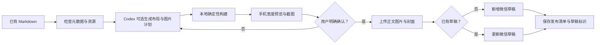

# WeChatLoom 产品需求文档

> 状态：需求基线已确认
> 日期：2026-07-29
> 产品形态：本地 Go CLI + Codex Skill + 本地浏览器预览
> 许可证：PolyForm Noncommercial 1.0.0

## 1. 产品定义

WeChatLoom 将已有 Markdown 文档转换为微信公众号兼容文章，完成内容检查、AI 辅助编排、原创主题渲染、图片处理、本地预览，并在用户明确确认后写入微信公众号草稿箱。

产品优先解决以下问题：

1. Markdown 到微信 HTML 的渲染结果稳定、可复现。
2. 主题和布局组件具备产品级视觉质量，而不是仅做语法转换。
3. Codex 能通过稳定的机器可读协议安全编排完整流程。
4. 微信凭证、文章内容和构建记录默认只保存在用户本地。
5. 创建和更新草稿具备明确门禁、可追踪记录和防重复机制。

## 2. 目标用户

首版面向：

- 已经使用 Markdown 写微信公众号长文章的个人、非商业创作者；
- 希望在 Codex 中完成排版、预览和草稿创建的用户；
- 希望单独使用 CLI 完成本地构建的用户；
- 需要多个公众号账号配置，但使用场景仍属于非商业用途的用户。

严格禁止的商业使用包括：

- 企业公众号运营；
- 为付费客户提供排版或发布服务；
- 推广付费产品、课程或商业服务；
- 将 WeChatLoom 作为 SaaS、付费软件、白标产品或商业内部工具使用。

## 3. 成功终点

首版的远程成功终点是：

> 一篇文章经检查、构建和预览后，在用户明确确认的前提下，被新增或更新到指定微信公众号的草稿箱。

“创建草稿成功”不等同于：

- 正式发布到公众号主页；
- 群发给关注者；
- 定时发布；
- 创建多图文组合草稿；
- 创建“小绿书”或图片帖子。

## 4. 核心用户流程



默认交互：

```bash
wechatloom inspect article.md
wechatloom build article.md
wechatloom preview article.md
wechatloom draft article.md --account personal --dry-run
wechatloom draft article.md --account personal --confirm
```

Codex Skill 可以编排上述步骤，但不能跳过预览和确认门禁。

## 5. 输入与元数据

### 5.1 Markdown 标准

必须支持：

- CommonMark；
- GFM 表格、任务列表、删除线；
- 脚注；
- 围栏代码块与语言标记；
- 相对路径图片；
- 数学公式；
- Mermaid 图表；
- `:::wx-*` 布局指令。

原始 HTML 必须经过白名单清洗。拒绝：

- `script`；
- `iframe`；
- 事件处理属性；
- `javascript:` URL；
- 未知危险标签和属性。

### 5.2 Frontmatter

Frontmatter 是发布元数据的稳定来源：

```yaml
---
title: 文章标题
author: 作者
digest: 摘要
cover: ./images/cover.png
source_url: https://example.com
theme: editorial-blue
---
```

优先级：

1. CLI 参数；
2. Frontmatter；
3. 项目配置；
4. 用户级配置；
5. 系统默认。

AI 可以为缺失的标题、摘要、封面方案和布局生成建议，但未经用户确认不得把建议用于远程草稿。

### 5.3 原稿保护

- 原始 Markdown 默认只读；
- AI 或布局增强写入派生稿；
- 只有用户明确要求时才能回写原稿；
- 正文默认不由 AI 改写；
- 润色、人性化或段落改写必须由用户主动请求并展示差异。

## 6. 布局与视觉系统

### 6.1 主题家族

首版至少交付 6 个原创主题家族，每个家族至少 4 套配色，共不少于 24 个主题：

| 家族 | 主要场景 |
|---|---|
| `minimal` | 知识、教程、工具说明 |
| `editorial` | 深度评论、人物、长文 |
| `tech` | 技术、AI、产品 |
| `business` | 商业分析、报告、服务介绍 |
| `culture` | 人文、书评、传统文化 |
| `lifestyle` | 生活方式、旅行、情感 |

每个主题必须基于统一设计变量：

- 色彩；
- 字体栈；
- 字号；
- 行高；
- 段落间距；
- 组件间距；
- 边框；
- 圆角；
- 阴影；
- 代码样式；
- 图片说明样式。

主题不得：

- 使用微信 Logo；
- 模仿微信气泡标识；
- 依赖官方绿色建立品牌混淆；
- 加载远程字体；
- 注入可执行模板代码。

### 6.2 布局组件

首版交付 24 个原创布局组件：

| 类别 | 组件 |
|---|---|
| 开场 | `hero`、`lead`、`toc`、`audience` |
| 结构 | `section`、`divider`、`steps`、`timeline`、`checklist` |
| 证据 | `callout`、`quote`、`metrics`、`compare`、`case`、`pros-cons` |
| 图文 | `image-text`、`gallery`、`code-card`、`data-card` |
| 收束 | `summary`、`takeaways`、`author`、`cta`、`subscribe` |

示例：

```markdown
:::wx-hero
title: 用一套稳定流程把 Markdown 送进公众号草稿箱
subtitle: 先检查、再构建、后预览，最后才创建草稿
:::
```

要求：

- 组件字段必须有机器可读 schema；
- 缺失必填字段或字段类型错误时默认阻止构建；
- 错误必须指出文件、行号、字段和最小可运行示例；
- `--lenient` 只能显式启用，并且必须产生警告；
- 未知组件不得静默丢失内容；
- Codex 自动选取少量合适组件，不能在一篇文章中堆叠全部组件。

### 6.3 自定义主题

允许主题包：

- `theme validate`；
- `theme install`；
- `theme export`；
- 本地分享与导入。

主题包只能包含设计变量、静态资源、预览和版本清单。首版不支持可执行组件插件。

## 7. AI 能力边界

核心 CLI 不直接调用任何大模型，也不保存模型 API Key。

Codex Skill 可以使用宿主 AI 完成：

- 标题建议；
- 摘要建议；
- 文章类型识别；
- 主题推荐；
- 布局计划；
- 图片计划；
- 用户明确请求的正文润色；
- 发布风险提示。

CLI 必须在没有 Codex Skill 和没有网络时完成：

- Markdown 解析；
- 手写组件验证；
- 确定性主题渲染；
- 公式和 Mermaid 处理；
- 本地预览；
- 发布清单生成。

AI 事实核查、敏感词判断和合规判断只作提示，不得宣称平台认证或替代人工审核。

## 8. 图片与媒体

### 8.1 支持范围

- 本地图片；
- 安全的公网 HTTP/HTTPS 图片；
- 封面图片；
- 数学公式生成的图片；
- Mermaid 生成的图片；
- Codex 根据结构化图片计划生成的图片。

### 8.2 安全规则

远程下载必须阻止：

- `localhost`；
- 私有网段；
- 链路本地地址；
- 云元数据地址；
- 非 HTTP/HTTPS 协议；
- 非图片响应；
- 超过限制的文件；
- 过多重定向；
- 超时请求。

### 8.3 处理规则

- 保留原图，派生压缩图写入构建目录；
- 公式和 Mermaid 转为高分辨率 PNG；
- 相同图片按账号和内容哈希去重；
- 正文图片与封面素材分别缓存；
- 缺少封面时不得自动使用正文首图；
- Codex 可以生成封面候选，但用户必须确认；
- 草稿失败后不自动删除已经上传的微信素材；
- 已上传素材记录在发布清单中并可复用。

## 9. 链接处理

提供三种策略：

| 策略 | 行为 |
|---|---|
| `preserve` | 尽可能保留链接 |
| `references` | 转成编号参考链接，默认策略 |
| `strip` | 删除链接，只保留文字 |

Frontmatter 中的 `source_url` 用作“阅读原文”。发布清单必须展示最终链接处理结果。

## 10. 本地预览

必须提供：

- 本地只读预览页；
- 主题切换；
- 常见手机宽度切换；
- 固定尺寸 PNG 截图；
- 主题与组件画廊；
- 构建警告展示；
- 与上一次构建的差异入口。

不捆绑 Chromium：

- 交互预览使用系统默认浏览器；
- 截图调用本地 Chrome、Chromium 或 Edge；
- CI 安装并固定浏览器版本做视觉回归；
- 本地缺少浏览器时只阻塞截图，不阻塞 HTML 构建。

本地预览必须说明：最终视觉以微信公众号草稿箱渲染为准。

## 11. 微信账号与草稿

### 11.1 官方接口

- 只使用微信公众号官方 API；
- 不使用浏览器自动化；
- 不绕过账号权限、验证码或 IP 白名单；
- 不具备接口权限的账号必须明确阻止远程操作。

### 11.2 多账号

支持命名账号和默认账号：

```yaml
wechat:
  default_account: personal
  accounts:
    personal:
      app_id: wx...
      app_secret: ...
```

创建草稿前必须显示：

- 账号名；
- 脱敏 AppID；
- 文章标题；
- 构建哈希；
- 新增或更新动作；
- 将要上传的资源；
- 预期副作用。

### 11.3 凭证

- 凭证只保存在用户级配置文件；
- 默认使用系统用户配置目录；
- Unix 权限必须为 `0600`；
- Windows 文件访问控制限制为当前用户；
- 项目配置不得包含凭证；
- `config show`、日志和 JSON 输出必须脱敏；
- `access_token` 按账号缓存、按过期时间刷新并脱敏。

### 11.4 新增与更新

- 首次提交新增草稿；
- 后续默认更新同一草稿；
- 草稿标识保存在本地状态中；
- `--new-draft` 才能显式创建新草稿；
- 一次草稿只包含一篇文章；
- 不支持图片帖子和多图文组合草稿。

### 11.5 防重复

- 构建生成内容哈希；
- 同账号、同文章、同内容哈希默认阻止重复新增；
- 网络超时不得盲目重试写操作；
- 重试前必须查询或提示用户核对草稿箱；
- 强制重新创建必须显式确认。

## 12. 配置与工作区

用户级配置：

```text
~/.config/wechatloom/
├── config.yaml
├── tokens/
├── cache/
└── themes/
```

项目级目录：

```text
.wechatloom/
├── project.yaml
├── builds/
└── state/
```

规则：

- `project.yaml` 可提交 Git；
- `builds/` 和 `state/` 默认加入 `.gitignore`；
- `wechatloom init` 不覆盖现有 `.gitignore` 规则；
- 项目配置不允许包含账号密钥；
- 优先级为 CLI 参数 → 项目配置 → 用户配置 → 默认值；
- 默认保留最近 20 次普通构建；
- 已成功提交草稿的发布清单不自动删除；
- 清理必须由 `wechatloom clean` 显式执行；
- 素材缓存独立管理。

## 13. CLI 接口

### 13.1 核心命令

| 命令 | 作用 | 默认远程副作用 |
|---|---|---|
| `init` | 初始化项目配置 | 无 |
| `inspect` | 检查文章、资源和 readiness | 无 |
| `plan` | 验证或写入布局计划 | 无 |
| `build` | 完成全部本地构建阶段 | 无 |
| `render` | 生成微信 HTML | 无 |
| `preview` | 启动本地预览 | 无 |
| `snapshot` | 生成固定尺寸截图 | 无 |
| `draft --dry-run` | 展示远程提交计划 | 无 |
| `draft --confirm` | 新增或更新微信草稿 | 有 |
| `account verify` | 联网验证账号能力 | 只读网络调用 |
| `doctor` | 本地配置体检 | 无 |
| `theme` | 主题发现、验证、安装、导出 | 安装时写本地 |
| `component` | 组件发现和 schema 查看 | 无 |
| `capabilities` | 聚合能力发现 | 无 |
| `skill` | 安装、检查和升级 Skill | 写用户 Skill 目录 |
| `clean` | 清理本地产物 | 需确认 |
| `update` | 显式检查或安装 CLI 更新 | 显式网络与写入 |

`build` 不能隐式创建草稿。

### 13.2 JSON 协议

所有命令支持 `--json`：

```json
{
  "success": true,
  "code": "BUILD_COMPLETED",
  "message": "Build completed",
  "schema_version": "1",
  "status": "completed",
  "retryable": false,
  "warnings": [],
  "data": {}
}
```

规则：

- stdout 只输出协议数据；
- stderr 输出诊断信息；
- 不输出密钥、token 或正文；
- 协议变更必须版本化；
- 命令和 JSON 字段使用英文；
- 人类提示默认中文，支持 `--lang en`。

## 14. 可复现性

发布清单必须记录：

- CLI 版本；
- 协议版本；
- 输入文件哈希；
- 派生 Markdown 哈希；
- 图片哈希；
- 主题名称和版本；
- 组件 schema 版本；
- 设计变量；
- 链接策略；
- 渲染参数；
- AI 生成的布局计划；
- 目标账号名；
- 草稿新增或更新结果。

同一 CLI、主题、组件版本和输入必须生成相同 HTML。AI 规划结果落盘后默认复用。

## 15. 隐私、安全与日志

- 无遥测；
- 无云端中转；
- 默认不联网检查更新；
- 默认不上传文章；
- 日志不包含正文、密钥、token 或完整请求；
- 诊断包默认只包含版本、配置结构、错误码和脱敏信息；
- 正文只有用户单独确认后才能加入诊断包；
- 远程请求设置超时和有限重试；
- 认证失败不重试；
- 写操作不自动重试；
- 发布清单和缓存不得复制 AppSecret。

## 16. 分发与许可

### 16.1 名称

- 产品名：WeChatLoom；
- CLI：`wechatloom`；
- Skill：`wechatloom`；
- GitHub 建议仓库名：`wechatloom`。

必须显著声明：

> Unofficial project. Not affiliated with or endorsed by Tencent or WeChat.

品牌使用原创“文字 × 织机/经纬线”视觉，不使用腾讯或微信 Logo。

### 16.2 许可证

- 使用 PolyForm Noncommercial 1.0.0；
- 对外称“源码可用”，不称 OSI 开源；
- 用户拥有输入文章和生成内容的权利；
- 用户必须确保文章和图片具有合法使用权；
- 官方主题、组件和 Skill 使用项目许可证；
- 用户自建主题归用户所有；
- 提交到官方仓库的主题和代码使用项目许可证；
- 外部贡献采用 DCO `Signed-off-by`。

### 16.3 发布渠道

GitHub Releases 是唯一可信发布源，包含：

- macOS `arm64`、`amd64`；
- Linux `arm64`、`amd64`；
- Windows `amd64`；
- SHA-256 校验文件；
- SBOM；
- 第三方许可清单。

Windows ARM 可以实验性提供，但不作为首版正式支持目标。

安装入口：

- Homebrew Tap；
- Shell 安装脚本；
- PowerShell 安装脚本；
- 手动下载。

所有入口只下载并校验 GitHub Release。

更新必须显式执行：

```bash
wechatloom update check
wechatloom update install
```

## 17. 非目标

首版明确不做：

- 从主题或提纲开始自动写完整文章；
- 正式发布、群发或定时发布；
- 浏览器模拟登录微信公众号后台；
- 图片帖子或“小绿书”；
- 多图文组合草稿；
- MCP Server；
- 独立桌面应用；
- 云端后台或账号系统；
- 内置模型 Provider；
- 可执行第三方组件插件；
- 商业使用；
- 后台自动更新；
- 未经确认修改原始 Markdown；
- 未经确认创建或更新微信草稿。

## 18. v1.0 验收标准

### 功能

- 所有核心命令实现统一 JSON 协议；
- CLI 可在无 Codex、无模型 Key 时完成离线构建；
- 支持新增和更新单篇微信草稿；
- 多账号配置和目标账号显示正确；
- 防重复和内容哈希生效；
- 本地、远程、公式、Mermaid 图片均可处理；
- 主题包可验证、安装和导出；
- Codex Skill 能完成 confirm-first 工作流。

### 视觉

- 至少 6 个主题家族、24 个主题；
- 24 个布局组件；
- 每个主题拥有完整基准文章预览；
- 每个组件具有 schema、有效示例和错误示例；
- 视觉回归覆盖主题家族、组件、代码、表格、公式、Mermaid 和图片；
- 真实微信草稿箱完成移动端人工验收。

### 安全与隐私

- 密钥与 token 不进入日志、JSON、构建目录和 Git；
- 配置文件权限检查通过；
- SSRF 测试通过；
- HTML 清洗测试通过；
- 写操作不存在自动重试；
- 无遥测、无隐式更新检查；
- 第三方依赖许可扫描通过。

### 跨平台

- macOS `arm64/amd64` 测试通过；
- Linux `arm64/amd64` 测试通过；
- Windows `amd64` 测试通过；
- 安装脚本验证校验和；
- GitHub Release 附带 SBOM 与第三方许可清单。

### 真实链路

- 使用非生产公众号验证账号；
- token 获取与刷新成功；
- 正文图片上传成功；
- 封面素材上传成功；
- 草稿新增成功；
- 草稿更新成功；
- 网络失败和微信错误能够安全恢复；
- 测试凭证从未进入仓库或 CI 日志。

## 19. 事实依据

竞品与微信能力调研见：

[md2wechat 产品能力调研](../research/md2wechat-product-analysis.md)
