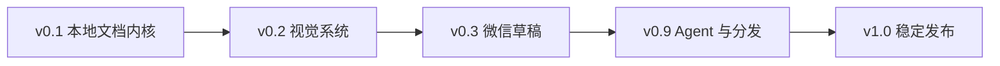

# WeChatLoom 实施路线图

> 日期：2026-07-29
> 目标：按风险递增顺序交付，先稳定本地确定性内核，再接微信远程副作用。

> 状态：v0.1、v0.2 已完成；v0.3 草稿代码链路已在 `0.3.0-dev` 完成，等待非生产公众号真实验收；v0.9 已具备 Skill 管理、GoReleaser、tag 发布工作流和双平台安装器，等待真实发布安装验收；V1.0 稳定化轨已启动，但各版本退出条件仍不得跳过。

## 1. 总体路线

每一阶段必须满足退出条件才能进入下一阶段。版本号代表成熟度，不代表可以跳过测试门槛。

## 2. v0.1：本地文档内核

### 目标

建立可复现、无网络、无微信副作用的 Markdown 构建内核。

### 工作包

#### 2.1 仓库与工程基线

- 初始化 Go module；
- 建立 `cmd/`、`internal/`、`themes/`、`components/`、`schemas/`、`skills/`；
- 添加 PolyForm Noncommercial 1.0.0；
- 添加非官方商标声明；
- 添加 DCO 与贡献说明；
- 配置 lint、unit test、race test、license scan；
- 配置跨平台 CI 编译；
- 生成第三方许可清单和 SBOM。

#### 2.2 Workspace

- 用户配置目录解析；
- 项目 `.wechatloom/` 初始化；
- 配置优先级；
- 配置 schema；
- 密钥字段项目级禁用；
- Unix/Windows 权限检查；
- 原子写入；
- 文件锁；
- 构建保留策略；
- `.gitignore` 安全更新。

#### 2.3 Protocol

- JSON envelope；
- 稳定错误码；
- stdout/stderr 分离；
- 中文/英文消息；
- 脱敏器；
- schema version。

#### 2.4 Builder 基础

- Frontmatter；
- CommonMark；
- GFM；
- 脚注；
- 代码块；
- 表格；
- 相对图片；
- HTML sanitizer；
- 链接三策略；
- 派生 Markdown；
- 微信兼容内联样式；
- manifest；
- 内容哈希；
- 原稿只读验证。

#### 2.5 组件语法

- `:::wx-*` parser；
- 组件 schema；
- 严格验证；
- 文件/行号/字段错误；
- `--lenient`；
- `layout-plan.json`。

#### 2.6 CLI

- `init`；
- `inspect`；
- `plan`；
- `build`；
- `render`；
- `doctor`；
- `capabilities`；
- `component list/show`。

### 退出条件

- 完全离线构建成功；
- 原稿零修改；
- 同输入同输出；
- JSON 协议测试通过；
- HTML 清洗测试通过；
- 项目配置无法保存 Secret；
- 所有失败不覆盖上一次成功构建；
- macOS/Linux/Windows CI 编译通过。

## 3. v0.2：视觉系统

### 目标

达到可作为产品发布的主题与布局质量。

### 工作包

#### 3.1 设计基础

- 定义设计变量 schema；
- 定义主题 manifest；
- 定义主题继承和覆盖顺序；
- 定义字体栈；
- 定义移动端排版栅格；
- 建立基准文章；
- 建立组件画廊。

#### 3.2 六个主题家族

- `minimal` × 4；
- `editorial` × 4；
- `tech` × 4；
- `business` × 4；
- `culture` × 4；
- `lifestyle` × 4。

每个主题必须完成：

- 标题层级；
- 正文；
- 列表；
- 引用；
- 代码；
- 表格；
- 图片；
- 图注；
- 链接；
- 24 组件；
- 明暗和对比度人工检查。

#### 3.3 24 个组件

按以下顺序实施：

1. 开场：`hero`、`lead`、`toc`、`audience`；
2. 结构：`section`、`divider`、`steps`、`timeline`、`checklist`；
3. 证据：`callout`、`quote`、`metrics`、`compare`、`case`、`pros-cons`；
4. 图文：`image-text`、`gallery`、`code-card`、`data-card`；
5. 收束：`summary`、`takeaways`、`author`、`cta`、`subscribe`。

#### 3.4 公式和 Mermaid

- 公式 parser；
- 高分辨率 PNG；
- Mermaid 安全渲染；
- 离线依赖打包；
- 图片缓存；
- alt 文本；
- 失败诊断。

#### 3.5 预览与截图

- 本地只读 preview server；
- 系统浏览器打开；
- 手机视口切换；
- 主题切换；
- 警告展示；
- Chrome/Chromium/Edge 发现；
- PNG snapshot；
- 缺少浏览器降级。

#### 3.6 主题包

- `theme list/show`；
- `theme validate`；
- `theme install`；
- `theme export`；
- 静态资源安全验证；
- 版本冲突处理。

#### 3.7 视觉回归

- 固定浏览器；
- 固定视口；
- 主题家族基准页；
- 组件画廊；
- 专项内容页；
- golden 审核流程；
- CI 差异产物。

### 退出条件

- 24 个主题完整；
- 24 个组件完整；
- 所有组件具备 schema、有效示例和错误示例；
- 所有主题通过基准页视觉回归；
- 公式、Mermaid、代码和表格通过专项回归；
- 本地预览不包含远程写入；
- 人工确认至少三种手机宽度可读。

## 4. v0.3：图片与微信草稿

> 当前进度：代码层已完成安全图片物化、命名账号、只读验证、私有 token 缓存、正文/封面上传缓存、dry-run、短期确认令牌、哈希门禁、草稿新增/更新、重复阻止、失败恢复和 `outcome_unknown` 持久化。尚未完成的退出条件是使用非生产公众号执行真实新增/更新、断网和凭证泄漏验收。

### 目标

在严格确认和可恢复前提下，完成真实公众号草稿新增与更新。

### 工作包

#### 4.1 媒体管线

- 本地图片规范化；
- 远程图片下载；
- SSRF 防护；
- MIME 检查；
- 大小和像素限制；
- 压缩与派生；
- 内容哈希；
- 正文/封面缓存分离；
- 账号级微信上传缓存；
- 上传结果持久化。

#### 4.2 账号与凭证

- 多账号配置；
- 默认账号；
- 配置权限；
- AppID 脱敏；
- token 缓存；
- token 过期刷新；
- `account verify`；
- IP 白名单错误提示。

#### 4.3 WeChat port

- 生产 HTTP adapter；
- 内存 mock adapter；
- token；
- 正文图片上传；
- 封面上传；
- 草稿新增；
- 草稿更新；
- 微信错误分类；
- 网络 outcome unknown。

#### 4.4 DraftPublisher

- `Plan`；
- `Submit`；
- dry-run；
- 确认令牌；
- 预览哈希门禁；
- 内容哈希校验；
- 目标账号显示；
- 新增/更新判断；
- `--new-draft`；
- 防重复；
- 失败恢复；
- 已上传素材复用；
- 状态原子提交。

#### 4.5 CLI

- `draft --dry-run`；
- `draft --confirm`；
- `account verify`；
- `clean`；
- 草稿状态查看；
- 不确定结果 reconciliation 指引。

#### 4.6 真实测试

- 使用非生产公众号；
- token 获取；
- 正文图片；
- 封面；
- 新增草稿；
- 更新草稿；
- 重复阻止；
- 网络中断；
- 微信错误码；
- 凭证泄漏扫描。

### 退出条件

- mock 测试覆盖所有远程分支；
- 真实账号新增草稿成功；
- 真实账号更新草稿成功；
- 重复提交默认阻止；
- 认证失败不重试；
- 写操作不自动重试；
- 不确定结果可人工核对恢复；
- Secret/token 泄漏扫描为零；
- 草稿失败不丢失素材记录。

## 5. v0.9：Codex Skill 与跨平台分发

> 当前进度：已实现内嵌 Skill 管理、GoReleaser 多平台独立二进制、tag 发布工作流、SHA-256/SBOM、Shell/PowerShell 安装器，以及显式 `update check/install`。尚未完成真实 GitHub Release、Homebrew Tap 和全新系统安装验收。

### 目标

形成别人可以从 GitHub 下载、安装和在 Codex 中使用的候选产品。

### 工作包

#### 5.1 Codex Skill

- 精确触发描述；
- confirm-first 流程；
- discovery-first；
- 原稿只读；
- AI/CLI 分工；
- 标题和摘要建议；
- 主题与布局推荐；
- 图片计划；
- 正文改写显式触发；
- draft side-effect 门禁；
- 错误处理；
- `skills read`/版本诊断。

#### 5.2 Skill 管理

- `skill install codex`；
- `skill status codex`；
- `skill update codex`；
- 来源版本记录；
- 不隐式修改 Codex；
- 安装/升级回滚。

#### 5.3 安装与发布

- GoReleaser 或等价流程；
- macOS `arm64/amd64`；
- Linux `arm64/amd64`；
- Windows `amd64`；
- Windows ARM 实验构建；
- SHA-256；
- SBOM；
- release notes；
- Shell installer；
- PowerShell installer；
- Homebrew Tap；
- 校验失败停止安装。

#### 5.4 文档

- 中文 README；
- 英文简版 README；
- 5 分钟快速开始；
- 凭证与 IP 白名单；
- Markdown 与 Frontmatter；
- 主题画廊；
- 组件参考；
- Codex 示例；
- 隐私与安全；
- 非商业许可；
- 商标免责声明；
- 故障排查；
- 贡献与 DCO。

#### 5.5 候选测试

- 全新 macOS 安装；
- 全新 Linux 安装；
- 全新 Windows 安装；
- CLI-only 路径；
- Codex Skill 路径；
- 离线路径；
- 多账号路径；
- 真实草稿路径；
- 升级与回滚；
- `update check/install` 显式联网。

### 退出条件

- 三个平台安装成功；
- Skill 可发现且版本匹配；
- 自然语言请求不会跳过确认；
- 文档可由新用户独立完成首次本地预览；
- 非生产公众号完成首次草稿；
- 发布包校验和、SBOM 和许可文件完整。

## 6. v1.0：稳定发布

> 当前进度：已冻结 JSON envelope，并以 CLI 契约测试覆盖本地构建、账号验证、草稿 dry-run/confirm、诊断、清理和显式更新；真实公众号草稿与跨平台发布验收等门槛继续保留。

### 发布门槛

必须同时满足：

- PRD 的全部 v1.0 验收标准；
- 架构接口与 JSON schema 冻结；
- 24 主题、24 组件完成视觉审查；
- 所有支持平台测试通过；
- 真实草稿新增和更新通过；
- 安全审查通过；
- 许可证扫描通过；
- 文档审查通过；
- 无 P0/P1 缺陷；
- 已知限制公开。

### 不允许为了发布降低的门槛

- 不得减少草稿确认；
- 不得关闭 SSRF 或 HTML 清洗；
- 不得把真实微信测试替换成 mock；
- 不得在视觉回归失败时自动更新 golden；
- 不得把 Secret 放入项目配置；
- 不得通过自动重试掩盖写入结果不确定；
- 不得把尚未完成的主题或组件计入数量。

## 7. 测试矩阵

| 维度 | 覆盖 |
|---|---|
| OS | macOS、Linux、Windows |
| CPU | amd64、arm64（Windows ARM 实验） |
| 使用方式 | CLI、Codex Skill |
| 网络 | 离线、远程图片、微信、更新 |
| Markdown | 基础、GFM、脚注、代码、表格、HTML |
| 媒体 | 本地、远程、公式、Mermaid、封面 |
| 主题 | 6 家族、24 主题 |
| 组件 | 24 个有效/无效样例 |
| 账号 | 单账号、多账号、无权限、白名单失败 |
| 草稿 | 新增、更新、重复、失败、不确定结果 |
| 安全 | Secret、SSRF、XSS、路径穿越、供应链 |

## 8. 风险登记

| 风险 | 影响 | 缓解 |
|---|---|---|
| 微信接口权限变化 | 草稿链路不可用 | `account verify`、能力发现、官方适配器隔离 |
| 微信渲染差异 | 本地与草稿不一致 | 内联样式、视觉基准、真实草稿人工验收 |
| 主题数量拖慢交付 | v0.2 延期 | 共享设计变量、家族基线、禁止未验收计数 |
| 组件过多导致文章噪声 | 阅读体验下降 | Agent 选择规则、布局计划、预览确认 |
| 浏览器截图环境漂移 | 回归噪声 | CI 固定浏览器和字体栈 |
| 远程图片攻击 | 本地网络风险 | SSRF、大小、MIME、超时与重定向复查 |
| 微信写入结果不确定 | 重复草稿 | outcome unknown、禁止自动重试、人工 reconciliation |
| 商标混淆 | 法律与分发风险 | 非官方声明、原创视觉、无微信 Logo |
| 非商业许可误解 | 用户违规 | README、安装和首次运行明确提示 |
| 贡献许可不清 | 后续分发风险 | DCO、统一项目许可证 |

## 9. 暂缓路线

以下内容不进入 v1.0：

- MCP Server；
- 桌面应用；
- 云端后台；
- 正式发布、群发、定时发布；
- 图片帖子；
- 多图文草稿；
- 从零写稿；
- 内置模型 Provider；
- 可执行组件插件；
- Windows ARM 正式支持；
- 商业授权和商业功能。

## 10. 第一批实施任务

开始编码时，第一批任务按以下顺序执行：

1. 创建 `wechatloom/` Go module 与许可证/商标声明；
2. 定义 JSON envelope 与错误码；
3. 定义 Workspace 配置和目录；
4. 建立 `Builder` 接口与最小 Markdown golden test；
5. 实现 `init`、`inspect`、`build --json`；
6. 建立组件 schema 和一个 `:::wx-callout` 端到端样例；
7. 建立 manifest 和可复现性测试；
8. 接入 CI、license scan 和跨平台编译。

在这些任务完成并验证前，不开始微信远程接口实现。
